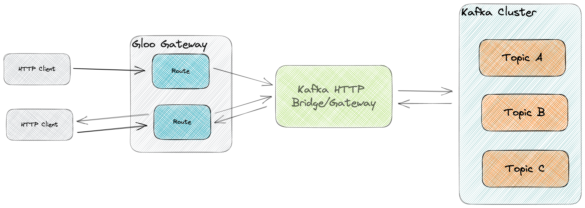

# Gloo and Apache Kafka: increasing the value of your Event Streaming environment with Gloo Gateway

Event driven architectures and event streaming applications are becoming core building blocks of mondern, cloud native applications that have the requirement to process realtime data at scale. Whether it's website tracking, hyper-personalization or fraud detection, applications have various requirements to produce, consume and process events in high volumes with low latency.

A common technology used in this space, and arguably the de-facto standard event streaming platform, is Apache Kafka. Apache Kafka is an open-source event streaming platform for high-performance data pipelines, streaming analytics, data integration, and mission-critical applications.

## Apache Kafka and External Consumers
Kafka is a broker-based technology, in which a set of Kafka brokers form a cluster that processes and stores events. Kafka uses its own Kafka binary protocol for communication, which allows for efficient and flexible processing of events. At the same time, Kafka puts a lot of responsibilities on the client. For example, the Kafka client is, and needs to be, fully aware of the broker topology (e.g. the locations of the individual brokers, which brokers are the topic parition leaders and replicas, etc.) and is responsible for keeping track of the offset of messages that it has consumed. This makes Kafka clients relatively complex and non-trivial to implement. Second, as the communication mechanism is not based on an open standard like HTTP, dedicated clients need to be built (and maintained and supported) for various programming languages and systems to connect them to Kafka. This results in an ecosystem with clients at various levels of maturity, with the Java client being the most mature.

Because of the above, exposing a Kafka-based system to external consumers can be more difficult than exposing HTTP-based micro-services. For the latter, a large ecosystems of (API) Gateways and (application) firewalls, like https://solo.io[solo.io] Gloo Edge and Gloo Gateway, exist to expose systems to external consumers in a secured and controlled way. As long as the client side is able to communicate over HTTP, they can consume the exposed functionality.

In this article we will explore how we can combine https://solo.io[solo.io] Gloo with Apache Kafka to expose Kafka systems to external consumers in secure and controlled manner, allowing organizations to expose their event streaming platforms and applications to their clients. This can open a large set of new capabilities, where external clients can benefit of the organizations capabilities to process and stream events at scale.

## Event Gateway pattern

A common architectural pattern to make an event streaming platform accessible to the widest possible range of users is the https://developer.confluent.io/patterns/event-source/event-gateway/[Event Gateway pattern]. In this pattern, access to the event streaming platform is provided via standard, well-supported interface. An example of such an interface is a RESTful API over HTTP.

Within the Kafka ecosystem, there are a number of components and tools that allow a Kafka cluster to be exposed over HTTP. The two most common components are:

- https://docs.confluent.io/platform/current/kafka-rest/index.html[Confluent REST Proxy]: The Confluent REST Proxy provides a RESTful interface to an Apache Kafka® cluster, making it easy to produce and consume messages, view the state of the cluster, and perform administrative actions without using the native Kafka protocol or clients.
- https://github.com/strimzi/strimzi-kafka-bridge[Strimzi Kafka Bridge]: This project provides a software component which acts as a bridge between HTTP 1.1 (Hypertext Transfer Protocol) and an Apache Kafka® cluster.

In this article, we will use the Strimzi Kafka Bridge, but note that a similar architecture can be implemented with the Confluent REST Proxy. 

## Gloo Gateway
Gloo Gateway is a feature-rich, Kubernetes-native ingress controller and next-generation API gateway. Gloo Gateway provides function-level routing, discovery capabilities, advanced security, authentication and authorization semantics, rate limiting and more, with support for legacy apps, microservices, and serverless. 

By using Gloo Gateways capabilities like authentication, authorization, rate limiting and monitoring, combined with a Kafka HTTP bridge/proxy, we can expose our Kafka environment in a secured, controlled and managed way to consumers. Second, by exposing Kafka over HTTP, Kafka clients no longer need to be available for your programming language of choice. This allows any system that can communicate over HTTP to interact with the Kafka environment, both producing events to the platform, as well as consuming event streams. This opens interesting new  possibilities and architectures in which event streams can be directly exposed to external consumers to implement realtime event-based systems.

## Exposing Apache Kafka over HTTP using the Strimzi Kafka Bridge

### Prerequisits
We will now deploy the proposed architecture on a Kubernetes cluster, connecting to a Kafka service in the cloud. To follow along with this example, you will need:

- a Kubernetes cluster: this can can be any Kubernetes cluster. In this example we will be running this on a local, single node, https://github.com/kubernetes/minikube[_minikube_] cluster
- a Kafka cluster: this can be any Kafka cluster, as longs as it is accessible from the Kubernetes cluster.
- a Kafka topic with the name `orders` with 1 partition.

As mentioned earlier, we will be using the Strimzi HTTP Bridge in this example, which allows us to configure the bridge in a Kubernetes native way using CRs. A similar architecture can also be implemented using the Confluent REST Proxy. We will leave that as an exercise for the reader.

### Installing Strimzi

First we will install https://strimzi.io/[Strimzi] on our Kubernetes cluster. Since Strimzi is an operator for Kubernetes, your Kubernetes cluster needs to have the Operator Lifecycle Manager (OLM) installed. If you don't have OLM install, you can easily do this by using the https://sdk.operatorframework.io/[Operator SDK]. Please consult the https://sdk.operatorframework.io/docs/installation/[Operator SDK Installation Guide] for instructions how to install the `operator-sdk` CLI. With the `operator-sdk` CLI installed, you can install OLM on your Kubernetes cluster using the following command:

[bash]
---- 
operator-sdk olm install
----

Once OLM has been installed, we're ready to install the Strimzi operator. First we create the Kafka namespace:

[bash]
---- 
kubectl create namespace kafka
----

With the `kafka` namespace created, we can now deploy the Strimzi operator in our Kubernetes cluster. We apply the Strimzi Operator YAML file that, among other things, installs the Strimzi CRDs and Service Accounts and deploys the Strimzi operator. Note the `namespace=kafka` query parameter, which make sure that the `ClusterRoles` and `ClusterRoleBindings` are installed in the correct namespace. More detailed installation instructions can be found https://strimzi.io/quickstarts/[here].

[bash]
---- 
kubectl create -f 'https://strimzi.io/install/latest?namespace=kafka' -n kafka
----

We can wait for the Strimzi deployment to become available using the following command:

[bash]
----
kubectl -n kafka wait --for condition=Available=True deployment strimzi-cluster-operator
----

We can also look at the resources deployed in our `kafka` namespace and see the Strimzi deployment, replicaset and pod:

[bash]
----
kubectl -n kafka get all
----

### Connecting to Kafka

In order to connect to a Kafka cluster, we need to know a number of configuration options of the given Kafka cluster. These include parameters like:

- Bootstrap Server
- Security Protocol
- Client ID & Secret

In this article we will be connecting to a Kafka cluster that uses the `SASL/PLAIN` security protocol. We will use a the _client id_ and _client secret_ of a service account that has access to our Kafka instance. Please consult the documentation of your Kafka environment and/or distribution for more information on how to create an account that has the required authorization to the Kafka cluster to send and receive events.

Note that the Strimzi Bridge supports various other security protocols, including OAuth. Please consult the https://strimzi.io/docs/bridge/latest/[Strimzi bridge documentation] for more details.

Execute the following command to create a Kubernetes Secret that stores the _client secret_ of your Kafka service account. Replace `{CLIENT_SECRET}` with the secret/password of your Kafka service account:

[bash]
----
kubectl -n kafka create secret generic gloo-kafka-sa-secret --from-literal=gloo-kafka-sa-client-secret-field={CLIENT_SECRET}
----

For the Strimzi Bridge to connect to your Kafka cluster over TLS, we need to configure a set of one or more trusted TLS certificates (i.e. the certificate of the Kafka cluster). We can do this by downloading the TLS certificate from the Kafka cluster and storing it in a Kubernetes Secret. This will allow us to reference the certificate from our Strimzi `KafkaBridge` CR. The following command downloads the certificate to your local filesystems and stores it in the file `kafka.crt`. Replace `{KAFKA_CLUSTER_URL}` with the URL of your Kafka cluster (e.g. the bootstrap-server url):

[bash]
----
echo | openssl s_client -servername {KAFKA_CLUSTER_URL} -connect {KAFKA_CLUSTER_URL} |  sed -ne '/-BEGIN CERTIFICATE-/,/-END CERTIFICATE-/p' > kafka.crt
----

After you've downloaded the TLS certificate from your Kafka cluster, you can store it in a Kubernetes Secret, so it can be accessed by the Strimzi Kafka Bridge to establish the TLS connection to your Kafka cluster:
[bash]
----
kubectl -n kafka create secret generic kafka-certs --from-file=kafka.crt=kafka.crt
----

With the client secret and TLS certificate stored in Kubernetes, you can now deploy the Strimzi `KafkaBridge` CR. Replace `{BOOTSTRAP_SERVER_URL}` with the _bootstrap-server url_ of your Kafka cluster, and the `{CLIENT_ID}`` with the _client id_ of your Kafka service account:

[bash]
----
cat <<EOF | kubectl apply -f -
apiVersion: kafka.strimzi.io/v1beta2
kind: KafkaBridge
metadata:
  name: gloo-kafka-bridge
  namespace: kafka
spec:
  replicas: 1
  bootstrapServers: {KAFKA_BOOTSTRAP_SERVER_URL}
  tls: 
    trustedCertificates:
    - secretName: kafka-certs
      certificate: kafka.crt
  authentication:
    type: plain
    username: {CLIENT_ID}
    passwordSecret:
      secretName: gloo-kafka-sa-secret
      password: gloo-kafka-sa-client-secret-field
    tlsTrustedCertificates:
    - secretName: kafka-certs
      certificate: kafka.crt
  http:
    port: 8080
EOF
----

Check the logs of the `KafkaBridge` pod that has been created and make sure there are no errors in the logs. Replace the `{kafka_bridge_pod_name}` with the name of your Kafka bridge pod:

[bash]
----
kubectl -n kafka logs {kafka_bridge_pod_name} -f
----

With the bridge running, we can now access it by port-forwarding port 8080 into the bridge pod. Later we will expose the Kafka bridge via Gloo Gateway. Replace the `{kafka_bridge_pod_name}` with the name of your Kafka bridge pod:

[bash]
----
kubectl -n kafka port-forward {kafka_bridge_pod_name} 8080
----

You can now access the Kafka bridge REST API from your local system. Let's try to list the `topics` in our Kafka cluster. If you have created a Kafka topic as described in the pre-requisits, the `orders` topic should be returned:

[bash]
----
curl http://localhost:8080/topics
----

Let's send an event to our `orders` topic via the REST API. With the command below, we're sending 2 events to Kafka in a single REST call, one with `key` "orderId1" and the other with "orderId2". The value of the event is a JSON message that contains the order data (in this  simpliefied example we simply send a productId):

[bash]
----
curl --location 'http://localhost:8080/topics/orders' -H 'Content-Type: application/vnd.kafka.json.v2+json' --data \
'{
   "records":[
      {
         "key":"orderId1",
         "value":{ "productId":"123abc" }
      },
      {
         "key":"orderId2",
         "value":{ "productId":"456ijk" }
      }
   ]
}'
----

We can verify that our events are stored on the Kafka topic by consuming from the topic via our REST API. We first need to register a Kafka consumer in a new _consumer group_:

[bash]
----
curl -X POST http://localhost:8080/consumers/gloo-kafka-consumer-group \
  -H 'content-type: application/vnd.kafka.v2+json' \
  -d '{
    "name": "gloo-kafka-consumer",
    "auto.offset.reset": "earliest",
    "format": "json",
    "enable.auto.commit": false,
    "fetch.min.bytes": 512,
    "consumer.request.timeout.ms": 30000
  }'
----

Next, we need to subscribe a new consumer to the `orders` topic in the _consumer group_ we've just created:

[bash]
----
curl -X POST http://localhost:8080/consumers/gloo-kafka-consumer-group/instances/gloo-kafka-consumer/subscription \
  -H 'content-type: application/vnd.kafka.v2+json' \
  -d '{
    "topics": [
        "orders"
    ]
}'
----

After which we can start polling for messages (note that it might take a few REST calls to retrieve messages due to internal Kafka semantics, like consumer rebalancing):

[bash]
----
while true; do curl -X GET http://localhost:8080/consumers/gloo-kafka-consumer-group/instances/gloo-kafka-consumer/records \
  -H 'accept: application/vnd.kafka.json.v2+json'; sleep 1; done
----

After a couple of REST calls, you will see the events being consumed from Kafka. Try sending some more messages to the Kafka topic and see how they get picked up by our Kafka consumer.

## Securing, Controlling and Managing the HTTP Kafka Bridge with Gloo Gateway

As explained in the https://strimzi.io/docs/bridge/in-development/#con-securing-http-interface-bridge[Strimzi Kafka Bridge documentation]:

_Authentication and encryption between HTTP clients and the Kafka Bridge is not supported directly by the Kafka Bridge. Requests sent from clients to the Kafka Bridge are sent without authentication or encryption. Requests must use HTTP rather than HTTPS. You can combine the Kafka Bridge with the following tools to secure it:_

- _Network policies and firewalls that define which pods can access the Kafka Bridge_
- _Reverse proxies (for example, OAuth 2.0)_
- _API gateways_

We will use Gloo Gateways advanced API Gateway functionalities to:
- Secure our Kafka Bridge with an API-Key.
- Apply access policies to secure the REST API, including access to Kafka topics.
- Apply rate limiting policies to control traffic from external consumer to our Kafka environment.

### Installing Gloo Gateway

First we need to install Gloo Gateway in our Kubernetes cluster. Detailed installation instructions can be found https://docs.solo.io/gloo-gateway/latest/getting_started/setup/[here]. Follow the instructions to install Gloo Gateway version `2.3.0` onto your Kubernetes cluster. Make sure that you also instal the `extAuthService` and the `rateLimiter`

### Expose the Kafka Bridge

With Gloo Gateway installed, we can now expose the Strimzi Kafka Bridge via the Gateway. To do that, we need to deploy a `VirtualGateway` to configure our ingress gateway and a `RouteTable` that defines the routing rules and routing policies that are applied to the traffic to our Kafka Bridge.

Most of the following commands require the cluster name of your Kubernetes cluster to be set. The easiest way to do this is to export the name of your Kubernetes cluster to an environment variable:

[bash]
----
export CLUSTER_NAME=$(kubectl config view --minify -o jsonpath='{.clusters[].name}')
----

Apply the following `VirtualGateway` custom resource. This will configure the Gloo Ingress Gateway to listen for HTTP traffic on port 80 for hostname `kafka.example.com`:

[bash]
----
cat <<EOF | kubectl apply -f -
apiVersion: networking.gloo.solo.io/v2
kind: VirtualGateway
metadata:
  name: istio-ingressgateway
  namespace: gloo-mesh-gateways
spec:
  listeners:
    - port:
        number: 80
      http: {}
      allowedRouteTables:
        - host: kafka.example.com
  workloads:
  - selector:
      labels:
        istio: ingressgateway
      cluster: ${CLUSTER_NAME}
EOF
----

To be able to use the `kafka.example.com` hostname, add the `kafka.example.com` hostname to your `/etc/hosts` file, and point it to the IP Address of your Kubernetes cluster's Ingress Gateway. When running this example on a local Kubernetes cluster, the address is simply 127.0.0.1:

----
127.0.0.1 kafka.example.com
----

We can now apply the RouteTable, which configures the routing from our Ingress Gateway into our Strimzi Kafka Bridge service. Note that we apply the label `route: kafka-bridge` to our route. This label will later be used in the authentication and rate-limit policies to select our route:

[bash]
----
cat <<EOF | kubectl apply -f -
apiVersion: networking.gloo.solo.io/v2
kind: RouteTable
metadata:
  name: kafka-example-com-rt
  namespace: gloo-mesh-gateways
spec:
  hosts:
  - kafka.example.com
  virtualGateways:
  - name: istio-ingressgateway
    namespace: gloo-mesh-gateways
  http:
  - matchers:
    - uri:
        prefix: /
    forwardTo:
      destinations:
        - port:
            number: 8080
          ref:
            name: gloo-kafka-bridge-bridge-service
            namespace: kafka
            cluster: ${CLUSTER_NAME}
    labels:
        route: kafka-bridge
EOF
----

With the `VirtualGateway` and `RouteTable` defined, and the `kafka.example.com` hostname mapped to the right ip-address in our `/etc/hosts` file, the Kafka cluster can now be accessed over HTTP via Gloo Gateway. Run the following command to retrieve the list of topics from your Kafka cluster:

[bash]
----
curl -v http://kafka.example.com/topics
----

### Securing the Kafka RESTful API

With the base-configuration in place, and our Gloo Gateway handling the HTTP traffic to Kafka via the Strimzi Kafka Bridge, we can enable more Gloo Gateway features. Let's start by securing our Kafka endpoints with an API-Key.

NOTE: You can use different mechanisms and protocols to secure your endpoints with Gloo Gateway, including OAuth2 and OpenID Connect. In this article we secure our APIs with API-Keys, as this architecture does not require any additional components, like an OAuth Provider, to be deployed on the Kubernetes cluster and be integrated with Gloo Gateway. For more information about Gloo Gateway's authentication and authorization capabalities, please consult the https://docs.solo.io/gloo-gateway/latest/policies/external-auth/[Gloo Gateway documentation].

To secure the Kafka endpoints with an API-Key, we first need to create the API-Key Secret in Kubernetes. In this example, we simply will use a pre-defined API-Key. In a production scenario you would use an API management tool such as Gloo Portal or Google Developer Portal, to generate an API key to use for your application's domain.

Apply the following Kubernetes secret which contains he `api-key`, a `user-id` and a `user-email` entry. Note that all values have been encoded in Base64:

[bash]
----
cat <<EOF | kubectl apply -f -
apiVersion: v1
kind: Secret
metadata:
  name: user-id-12345
  namespace: default
  labels:
    extauth: apikey
type: extauth.solo.io/apikey
data:
  # N2YwMDIxZTEtNGUzNS1jNzgzLTRkYjAtYjE2YzRkZGVmNjcy
  api-key: TjJZd01ESXhaVEV0TkdVek5TMWpOemd6TFRSa1lqQXRZakUyWXpSa1pHVm1OamN5
  # user-id-12345
  user-id: dXNlci1pZC0xMjM0NQ==
  # user12345@email.com
  user-email: dXNlcjEyMzQ1QGVtYWlsLmNvbQ==
EOF
----

Next, create the external auth server that is responsible for verifying credentials and determine permissions:

[bash]
----
cat <<EOF | kubectl apply -f -
apiVersion: admin.gloo.solo.io/v2
kind: ExtAuthServer
metadata:
  name: ext-auth-server
  namespace: gloo-mesh-addons
spec:
  destinationServer:
    ref:
      cluster: ${CLUSTER_NAME}
      name: ext-auth-service
      namespace: gloo-mesh-addons
    port:
      name: grpc
EOF
----
  
Finally, create an `ExtAuthPolicy` that enforces authorization with an API-Key on applicable routes. In our case this is the route to our Kafka Bridge. Note that the route-policy gets applied to all routes that have the label `kafka-bridge`, like the route we've created earlier. Also note that the API-Key is also selected by label (i.e. `extauth: apikey`):

[bash]
----
cat <<EOF | kubectl apply -f -
apiVersion: security.policy.gloo.solo.io/v2
kind: ExtAuthPolicy
metadata:
  name: api-key-auth
  namespace: default
spec:
  applyToRoutes:
  - route:
      labels:
        route: kafka-bridge
  config:
    server:
      name: ext-auth-server
      namespace: gloo-mesh-addons
      cluster: ${CLUSTER_NAME}
    glooAuth:
      configs:
        - apiKeyAuth:
            headerName: api-key
            k8sSecretApikeyStorage:
              labelSelector:
                extauth: apikey
EOF
----

When we now try to list our Kafka topics, Gloo Gateway returns a _401 - Unauthorized_

[bash]
----
curl -v http://kafka.example.com/topics
----

Adding the API-Key in a request header gives us access to our topics again:

[bash]
----
curl -v -H "api-key:N2YwMDIxZTEtNGUzNS1jNzgzLTRkYjAtYjE2YzRkZGVmNjcy" http://kafka.example.com/topics
----

Since our Gloo Gateway route applies to all RESTful resources that the Kafka Bridge exposes (e.g. producing events to Kafka, consuming events from Kafka), all of these operations are now secured with our API-Key policy. So, in order to produce messages to Kafka, we now also need to pass the API-Key in the HTTP header.

[bash]
----
curl -v --location 'http://kafka.example.com/topics/orders' -H 'api-key:N2YwMDIxZTEtNGUzNS1jNzgzLTRkYjAtYjE2YzRkZGVmNjcy' -H 'Content-Type: application/vnd.kafka.json.v2+json' --data \
'{
   "records":[
      {
         "key":"orderId3",
         "value":{ "productId":"345str" }
      }
   ]
}'
----

Note that this API-Key based security just shows the basics of what is possible with Gloo Gateway. Using Gloo Gateway and the Strimzi Kafka Bridge, you can now implement more advanced security schemes for your Kafka environment, for example using different API-Keys for producing and consuming messages, using different keys for different topics, and even implementing multi-step authentication and authorization using https://docs.solo.io/gloo-gateway/main/policies/external-auth/multi-extauth/[API-Keys and OPA (Open Policy Agent)].

### Rate Limiting the Kafka RESTful API

Another interesting feature that Gloo Gateway can add to our Kafka system is https://docs.solo.io/gloo-gateway/latest/policies/rate-limit/[rate-limiting]. Rate limiting allows us to limit the number of requests per time unit (seconds, minutes, hours, etc.) based on policies. It enables us to, for example, protect the service from mis-use by clients, enforce service and/or business limits based on service offering categories and business plancs, etc.

As an example use-case, let's implement a rate limiting policy that only allows 3 requests per minute with the API-Key we defined earlier.

First we apply the `RateLimitServerSettings`, which configures how clients connect to the rate-limiting server:

[bash]
----
cat <<EOF | kubectl apply -f -
apiVersion: admin.gloo.solo.io/v2
kind: RateLimitServerSettings
metadata:
  name: rl-server
  namespace: gloo-mesh-addons
spec:
  destinationServer:
    port:
      name: grpc
    ref:
      cluster: ${CLUSTER_NAME}
      name: rate-limiter
      namespace: gloo-mesh-addons
EOF
----

Now we need to configure the rate-limit server and client configurations using the `RateLimitServerConfig` and `RateLimitClientConfig` CRs. In this example, the rate-limiting descriptor applies the rate-limit for any unique `userId`. Remember that the `userId` field is a data field in of our API-Key secret. Hence, this allows us to rate-limit per API-Key, as long as the `userId` field is unique per API-Key:

[bash]
----
cat <<EOF | kubectl apply -f - 
apiVersion: admin.gloo.solo.io/v2
kind: RateLimitServerConfig
metadata:
  annotations:
    cluster.solo.io/cluster: ""
  name: rl-server-config
  namespace: gloo-mesh-addons
spec:
  destinationServers:
  - port:
      number: 8083
    ref:
      cluster: ${CLUSTER_NAME}
      name: rate-limiter
      namespace: gloo-mesh-addons
  raw:
    descriptors:
    - key: userId
      rateLimit:
        requestsPerUnit: 3
        unit: MINUTE
---
apiVersion: trafficcontrol.policy.gloo.solo.io/v2
kind: RateLimitClientConfig
metadata:
  annotations:
    cluster.solo.io/cluster: ""
  name: rl-client-config
  namespace: gloo-mesh-addons
spec:
  raw:
    rateLimits:
    - actions:
      - metadata:
          descriptorKey: userId
          metadataKey:
            key: envoy.filters.http.ext_authz
            path:
              - key: userId  
EOF
----

Finally, we can apply the `RateLimitPolicy`, which applies the rate-limit server config, client config and server settings to one or more routes. The routes are, as with the `ExtAuthPolicy`, selected using labels:

[bash]
----
cat <<EOF | kubectl apply -f -
apiVersion: trafficcontrol.policy.gloo.solo.io/v2
kind: RateLimitPolicy
metadata:
  name: kafka-rate-limit
  namespace: default
spec:
  applyToRoutes:
  - route:
      labels:
        route: kafka-bridge
  config:
    ratelimitServerConfig:
      name: rl-server-config
      namespace: gloo-mesh-addons
      cluster: ${CLUSTER_NAME}
    ratelimitClientConfig:
      name: rl-client-config
      namespace: gloo-mesh-addons
    serverSettings:
      name: rl-server
      namespace: gloo-mesh-addons
    phase:
      postAuthz:
        priority: 1
EOF
----

When we now execute our Kafka REST requests multiple time in a row, for example sending events to the _orders_ topic, we will see that after 3 requests per minute, we are rate limited and we get a _429 - Too Many Requests_ HTTP response. Execute the following request 4 times in a row, and observe how the last request will be rate-limited:

[bash]
----
curl -v --location 'http://kafka.example.com/topics/orders' -H 'api-key:N2YwMDIxZTEtNGUzNS1jNzgzLTRkYjAtYjE2YzRkZGVmNjcy' -H 'Content-Type: application/vnd.kafka.json.v2+json' --data \
'{
   "records":[
      {
         "key":"orderId34,
         "value":{ "productId":"987cba" }
      }
   ]
}'
----

## Conclusion

Event driven and even streaming architectures are popular architectural paradigms to implement realtime data systems at scale. Often though, the benefits of event streaming platforms are only reaped internally in organizations, as exposing systems like Apache Kafka to external consumers can be difficult due to the use of non-standard protocols, security requirements, and network architectures. By using an API Gateway like Gloo Gateway, in combination with an HTTP Bridge to expose the internal event streaming platform over HTTP, we can create architectures in which the power of the event streaming platform can be safely and securely exposed to external consumers. Advanced functionalities like authentication and auhthorization based on API-Keys, OAuth and OPA, combined with features like rate-limiting, give us control over how the event streaming platform is exposed to consumers, provide fine-grained control over which consumers have access to which part of the system, and can protect the event streaming platform from external mis-use and potential abuse.

In this article we've shown a basic integration of Gloo Gateway with Apache Kafka, laying the foundations of more advanced architectures powered by Gloo. Please consult the https://docs.solo.io/gloo-gateway/latest/[Gloo Gateway documentation] to learn more about this powerful API Gateway and the features it provides.