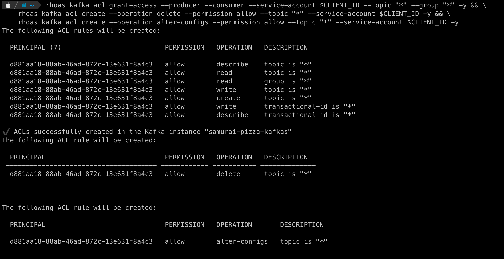
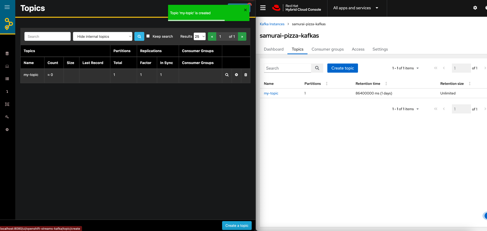

# Managing OpenShift Streams for Apache Kafka with 

Apache Kafka ® has quickly become the defacto event streaming platform, enabling organizations to unlock and use their data in new and innovative ways in near real time. This has opened numerous new use-cases that allows these companies to bring more value to their products by being able to quicker and more accurately respond to change.

From a high-level perspective, Apache Kafkas architecture is quite simple and based on a small number of concepts like brokers, topics, partitions, producers and consumers. When deploying, operating, managing and monitoring a production Kafka cluster, things can become, as with any system, complex quite quickly. In order to effectively use and manage a Kafka cluster in both development and production environments, there are numerous tools on the market, both commercial and open source. These tools range from scripts, to powerful CLIs (command line interfaces), to GUIs (graphical user interfaces), to full monitoring, management and governance platforms. Each of these tools serves a purpose in part of the softwarde development cycle, and therefore its impossible to answer questions which of these tools is the best when it comes to operating Apache Kafka.

In this blog post we will take a look at https://akhq.io[AKHQ], an open source Kafka GUI for Apache Kafka ® to manage topics, topics data, consumers group, schema registry, connect and more. At Red Hat, we often get the question what kind of consoles and GUIs can be used with our Kafka products, Red Hat AMQ Streams and Red Hat OpenShift Streams for Apache Kafka. Since our products are fully based on the upstream Apache Kafka project, most of the available consoles and GUIs work with our Kafka products. Today we will show to connect AKHQ to a Red Hat OpenShift Streams for Apache Kafka managed cloud service. Using our free 48 hours trial of OpenShift Streams, you will be able to follow along with this blog post, and by the end manage your OpenShift Streams for Apache Kafka with AKHQ.

# Prerequisits

To follow along with the instructions in this article, you will need a number of things:

* A Red Hat OpenShift Streams for Apache Kafka instance (either a trial or a full instance): 48 hours free trial instances are available. Simply go to https://console.redhat.com/application-services/streams, login with your Red Hat account (or create one if you don't have one yet), and create a trial instance. More information can be found in this quick start: https://console.redhat.com/application-services/learning-resources?quickstart=getting-started
* The RHOAS CLI. A powerful CLI to manage various Red Hat OpenShift Application Services resources, like OpenShift Streams Kafka instance, Service Registry, Service Accounts and more. The RHOAS CLI can be downloaded here: https://github.com/redhat-developer/app-services-cli/releases
* A container runtime like Podman or Docker in which we will run our AKHQ container.

# Creating a Service Account

In order for AKHQ to be able to connect to your OpenShift Streams for Apache Kafka, it needs credentials to authenticate with the service. In the OpenShift Streams world this means that we need to create a Service Account. This can be done via the UI, CLI and API. Here we will use the UI.

* Navigate to https://console.redhat.com/application-services/service-accounts and click on the "Create service account" button.
* Provide a description for the account. Let's call it `akhq-sa`.
* You will be presented with a `Client ID` and `Client secret`. Copy these values to a safe place, check "I have copied the client ID and secret" and click the "Close" button

image::images/service-account.png[Service Account]

# Configuring Kafka ACLs

Before the Service Account can be used by AKHQ to manage our OpenShift Streams instance, we need to configure the authorization of the account using Kafka ACLs (Access Control List). We need to provide the service account enough access rights to, for example, create and delete topics, produce and consume messages.

To set the ACLs on the OpenShift Streams instance for the service account, we will use the `rhoas` CLI. Note that this can also be achieved via the GUI and API.

Note that this article we will demonstrate how AKHQ can be used to manage topics and consumer-groups, and therefore will only set the ACLs required to manage thos resources.  If you want to manage other Kafka resources, for example the Kafka broker configuration, you might need to configure additional ACLs on your service account. Make sure to only set the ACLs on the service account that are needed to implement your use-case to limit the attach surface of your Kafka cluster.

First we need to login to our `rhoas` CLI. This will use a browser-based login flow. Login with the Red Hat account you used to create your OpenShift Streams instance.

```
$ rhoas login
```

Next we need to select the OpenShift Streams instance we would like to use. This sets the OpenShift Streams instance in the context of our CLI, meaning that the following operations we execute with the CLI, for example settings ACLs, will performed against this Kafka instance.

```
$ rhoas kafka use
```

Now we can use the CLI to set the required Kafka ACLs. We use the `grant-access` operation to quickly set the required set of ACLs to produce to, and consume from, any topic in the Kafka cluster. To be able to fully managge the topics from AKHQ, we also need to set allow the `delete` and `alter-configs` operations on the topics.

```
$ export CLIENT_ID={your-service-account-client-id}
$ rhoas kafka acl grant-access --producer --consumer --service-account $CLIENT_ID --topic "*" --group "*" -y && \
    rhoas kafka acl create --operation delete --permission allow --topic "*" --service-account $CLIENT_ID -y && \
    rhoas kafka acl create --operation alter-configs --permission allow --topic "*" --service-account $CLIENT_ID -y
```



NOTE: In this example we use the `*` wildcard to set the ACLs for all topics in the Kafka cluster. You can limit the this by setting the ACLs for a specific topic name or a set of topics with a given prefix.

With our ACLs in place, we can now configure AKHQ to connect to our OpenShift Streams instance.

# Connecting AKHQ to OpenShift Streams for Apache Kafka

There are multiple ways in which you can run AKHQ. The https://akhq.io/docs/installation.html[AKQH installation documentation] describes the various options that are available in detail. In this article we will be running AKHQ in a container. This means, as already mentioned in the pre-requisit, that you will need to have a container runtime, like Podman or Docker available. We will be running the container using Docker Compose (you can also use Podman Compose with the same compose file).

The AKHQ configuration that we will use in this example is a very basic configuration that demonstrates how to connect to an OpenShift Streams Kafka instance using SASL/OAUTHBEARER authentication, using the Client ID and Client Secret of the service account we created earlier. The configuration looks as follows:

~~~
akhq:
  # list of kafka cluster available for akhq
  connections:
    openshift-streams-kafka:
      properties:
        bootstrap.servers: "${BOOTSTRAP_SERVER}"
        security.protocol: SASL_SSL
        sasl.mechanism: OAUTHBEARER
        sasl.jaas.config: >
          org.apache.kafka.common.security.oauthbearer.OAuthBearerLoginModule required 
            oauth.client.id="${CLIENT_ID}" 
            oauth.client.secret="${CLIENT_SECRET}" 
            oauth.token.endpoint.uri="${OAUTH_TOKEN_ENDPOINT_URI}" ;
        sasl.login.callback.handler.class: io.strimzi.kafka.oauth.client.JaasClientOauthLoginCallbackHandler
~~~

Note that we're using the OauthLoginCallbackHandler from the https://strimzi.io/[Strimzi project], which is packaged by default with AKHQ, to use OAuthBearer authentication against OpenShift Streams.

We use this same configuration in the `docker-compose.yml` file we will use to run our containerized AKHQ instance. The `docker-compose.yml` file can be found in this https://github.com/DuncanDoyle/rhosak-akhq-blog[GitHub repository]

To run AKHQ and connect it to your OpenShift Streams instance, we will first clonse the GitHub repisory with our `docker-compose.yml` file.

~~~
$ git clone https://github.com/DuncanDoyle/rhosak-akhq-blog.git
$ cd rhosak-akhq-blog
~~~

Next, we need to set a number of environment variables that will hold the value of our service account's client id and client secret, the oauth token endpoint uri, and the url and port of the bootstrap server of our Kafka instance. The boostrap server url can be retrieved via the OpenShift Streams for Apache Kafka UI, or by using the `rhoas kafka describe` CLI command. The oauth token endpoint url can be found in the same way, but we can simply set it to `https://sso.redhat.com/auth/realms/redhat-external/protocol/openid-connect/token` as it is a static value.

image::images/rhosak-bootstrap-server.png[RHOSAK Bootstrap Server]

~~~
$ export CLIENT_ID={your-service-account-client-id}
$ export CLIENT_SECRET={your-service-account-client-secret}
$ export BOOTSTRAP_SERVER={your-kafka-bootstrap-server-url-and-port}
$ export OAUTH_TOKEN_ENDPOINT_URI=https://sso.redhat.com/auth/realms/redhat-external/protocol/openid-connect/token 
~~~

We can now start AKHQ using `docker-compose` or `podman-compose`:

~~~
$ docker-compose up
~~~

The AKHQ management console will be available at http://localhost:8080

If you've configured everything correctly, you should see the `openshift-streams-kafka` connection when hovering over the datastore icon.

image::images/rhosak-bootstrap-server.png[RHOSAK AKHQ]

# Working with OpenShift Streams

With our management console connected, we can create a topic, produce some data, and inspect the data we've produced to the topic.

First we need to create a topic. We can obviously do this from the OpenShift Streams UI, and from the `rhoas` CLI, but in this case we want to use the AKHQ console. In the lower right corner of AKHQ, click on the blue _Create a topic_ button. Name the topic `my-topic` and use the default values for all the other options and click _Create_ 

image::images/akhq-create-topic.png[RHOSAK AKHQ]

If you've set the ACLs on the service account correctly, you will see the topic that you just created. You will also see the topic appear in the OpenShift Streams UI in the Red Hat Hybrid Cloud Console.



By clicking on the topic we've just created, we can now inspect messages, produce messages to topic, see the consumer groups that are consuming from the topic, inspect their consumer-lag, etc.

More information about AKHQ can be found in the https://akhq.io/docs/[AKHQ documentation]

# Conclusion

In this article we've demonstrated how https://console.redhat.com/application-services/streams[Red Hat OpenShift Streams for Apache Kafka] instance can be managed and monitored using AKHQ. The ability to utilize popular tools from the open source Kafka ecosystem with the Red Hat Managed Cloud Services offerings provides our users the flexibility they need when building enterprise scale systems based on open source technologies. The use of open-standards and non-proprietary APIs and protocols in our service offerings enables a seamless integration with various technologies.

If you've not yet done so, please visit our https://console.redhat.com/[Red Hat Hybrid Cloud Console] for more information about OpenShift Streams for Apache Kafka, as well as our other services offerings. https://console.redhat.com/application-services/streams[OpenShift Streams for Apache Kafka] provides a 48 hours trial version of our product, so feel free to give it a spin.