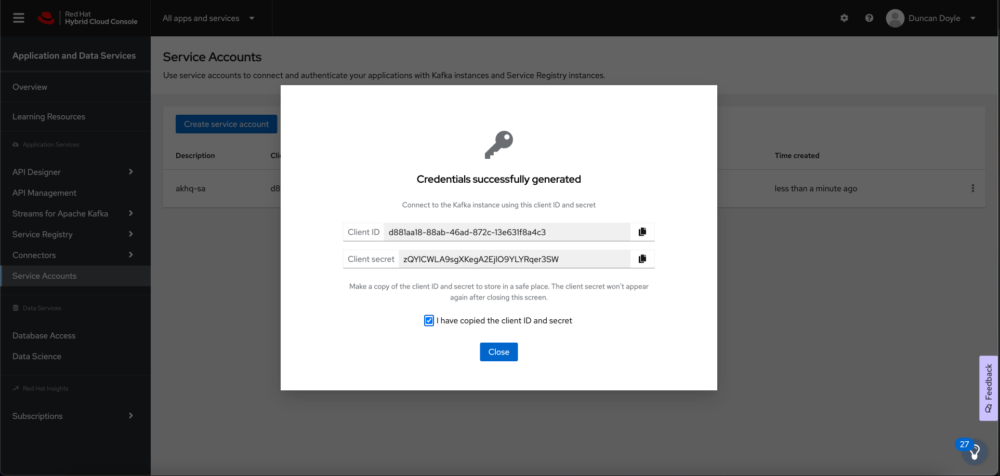

# Managing OpenShift Streams for Apache Kafka with AKHQ

At Red Hat, we are often asked about the consoles and GUIs that can be used with our Kafka products Red Hat AMQ Streams and Red Hat OpenShift Streams for Apache Kafka. Because our products are fully based on the upstream Apache Kafka project, most of the available consoles and GUIs work with our Kafka products. In this blog post, we will take a look at https://akhq.io[AKHQ], an open source graphical user interface (GUI) for Apache Kafka ®. We will show to use AKHQ to manage a Kafka instance in the Red Hat OpenShift Streams for Apache Kafka managed cloud service. Read on to learn more.

## Introduction

Apache Kafka has quickly become the leading event-streaming platform, enabling organizations to unlock and use their data in new and innovative ways. With Apache Kafka, companies can bring more value to their products by processing real-time events more quickly and accurately.

At a high level, Apache Kafka's architecture is quite simple, and based on a small number of concepts, such as brokers, topics, partitions, producers, and consumers. However -- as with any system -- when you deploy, operate, manage, and monitor a production Kafka cluster, things can quickly become complex. For using and managing Kafka clusters in both development and production environments, there are numerous tools on the market, both commercial and open source. These tools range from scripts, graphical user interfaces (GUIs), and powerful command-line interfaces (CLIs) to full monitoring, management, and governance platforms. Each type of tool has value in specific parts of the software-development cycle.

In this blog post, we will take a look at https://akhq.io[AKHQ]. AKHQ is an an open source GUI for Apache Kafka that enables you to manage topics, topic data, consumer groups, schemas, and more. We will show to connect AKHQ to a Kafka instance in the Red Hat OpenShift Streams for Apache Kafka managed cloud service. Using our no-cost, 48-hour trial of OpenShift Streams, you will be able to follow along with the steps. By the end of the blog post, you will be able to use AKHQ to manage your Kafka instance.

## Prerequisites

To follow the instructions in this blog post, you will need the following:

* A Kafka instance in Red Hat OpenShift Streams for Apache Kafka (either a trial instance or full instance). 48-hour trial instances are available at no cost. Go to https://console.redhat.com/application-services/streams, log in with your Red Hat account (or create one), and create a trial instance. Learn how to create your first Kafka instance in the following quick start: https://console.redhat.com/application-services/learning-resources?quickstart=getting-started.
* The `rhoas` CLI. This is a powerful command-line interface for managing various Red Hat OpenShift Application Services resources, such as Kafka instances, Service Registry instances, service accounts, and more. Download the RHOAS CLI at https://github.com/redhat-developer/app-services-cli/releases.
* A container runtime such as Podman or Docker to run the AKHQ container image used in this post.

The sections that follow show to generate connection information for a Kafka instance in OpenShift Streams and then use this informtion to connect AKHQ to the Kafka instance.

## Creating a Service Account

For AKHQ to connect to your Kafka instance, it needs credentials to authenticate with the OpenShift Streams for Apache Kafka service. In the OpenShift Application Services world, this means that you must create a service account. You can do this using the web console, the CLI, or with a REST API. The following steps show to use the web console.

. Navigate to https://console.redhat.com/application-services/service-accounts and click *Create service account*.
. Enter a name for the service account. In this case, let's call it `akhq-sa`. 
. Click *Create*.
. Copy the generated *Client ID* and *Client secret* values to a secure location. You’ll specify these credentials when configuring a connection to the Kafka instance.
. After you save the generated credentials to a secure location, select the confirmation check box and click *Close*, as shown in the figure.
+
.Creating a service account in the OpenShift Streams console


## Configuring Kafka permssions

Before AKHQ can use the service account to connect to your Kafka instance in OpenShift Streams, you need to configure authorization of the account using Kafka _Access Control List_ (ACL) permissions. At a minimum, you need to give the service account permissions to create and delete topics and produce and consume messages.

To configure ACL permissions for the service account, we will use the `rhoas` CLI. You can also use the web console or a REST API to set these.

NOTE: In this blog post, we show how to use AKHQ to manage topics and consumer groups. Therefore, we set only the ACLs required to manage those resources. If you want to manage other Kafka resources -- for example the Kafka broker configuration -- you might need to configure additional ACL permissions for your service account. However, always be sure to set *only* the permissions that are needed for your use case. This limits the attack surface of your Kafka cluster, maximizing security.

The following steps show how to set the required ACL permissions for your service account.

. Log in to the `rhoas` CLI.
+
```
$ rhoas login
```
+
A login flow opens in your web browser. 

. Log in with the Red Hat account that you used to create your OpenShift Streams instance.

. Next, specify the Kafka instance in OpenShift Streams that you would like to use.
+
```
$ rhoas kafka use
```
+
The `rhoas kafka use` command sets the OpenShift Streams instance in the context of your CLI, meaning that subsequent CLI operations (for example settings ACLs), are performed against this Kafka instance.

. Now, use the CLI to set the required Kafka ACL permissions, as shown in the following example: 
+
[source,options="nowrap"]
----
$ export CLIENT_ID={your-service-account-client-id}
$ rhoas kafka acl grant-access --producer --consumer --service-account $CLIENT_ID --topic "*" --group "*" -y && \
    rhoas kafka acl create --operation delete --permission allow --topic "*" --service-account $CLIENT_ID -y && \
    rhoas kafka acl create --operation alter-configs --permission allow --topic "*" --service-account $CLIENT_ID -y
----
+
In the example, you use the `grant-access` command to set ACL permissions to produce and consume messages in any topic in the Kafka instance. To fully manage topics from AKHQ, you also allow the `delete` and `alter-configs` operations on any topic.
+
.Setting ACL permissions using the rhoas CLI
image::images/rhoas-set-acls.png[RHOAS set ACLs]

NOTE: In this example we use the `*` wildcard character to set permissions for all topics in the Kafka cluster. You can limit this by setting the permissions for a specific topic name or a set of topics, using a given prefix.

With your ACL permissions in place, you can now configure AKHQ to connect to your Kafka instance in OpenShift Streams.

## Connecting AKHQ to OpenShift Streams for Apache Kafka

There are multiple ways to run AKHQ. The https://akhq.io/docs/installation.html[AKQH installation documentation] describes the various options in detail. In this article, we will run AKHQ in a container. This means that you will need a container runtime such as Podman or Docker. We will show how to run the container using Docker Compose, but you can also use Podman Compose with the same compose file.

The AKHQ configuration that we'll use in this example is a very basic configuration that shows how to connect to an OpenShift Streams Kafka instance using SASL/OAUTHBEARER authentication. The configuration uses the client ID and client secret values of your service account and an OAuth token endpoint URL required for authentication with the Red Hat single sign-on (SSO) service. The example configuration looks as follows:

```
akhq:
  # list of kafka cluster available for akhq
  connections:
    openshift-streams-kafka:
      properties:
        bootstrap.servers: "${BOOTSTRAP_SERVER}"
        security.protocol: SASL_SSL
        sasl.mechanism: OAUTHBEARER
        sasl.jaas.config: >
          org.apache.kafka.common.security.oauthbearer.OAuthBearerLoginModule required 
            oauth.client.id="${CLIENT_ID}" 
            oauth.client.secret="${CLIENT_SECRET}" 
            oauth.token.endpoint.uri="${OAUTH_TOKEN_ENDPOINT_URI}" ;
        sasl.login.callback.handler.class: io.strimzi.kafka.oauth.client.JaasClientOauthLoginCallbackHandler
```

Observe that the configuration also uses the `OauthLoginCallbackHandler` class from the https://strimzi.io/[Strimzi project]. This callback handler class is packaged by default with AKHQ, enabling you to use OAuthBearer authentication against OpenShift Streams.

The configuration shown is included in the `docker-compose.yml` file that we'll use to run our containerized AKHQ instance. You can find the `docker-compose.yml` file in this https://github.com/DuncanDoyle/rhosak-akhq-blog[GitHub repository].

The following steps show to use Docker Compose to connect AKHQ to your Kafka instance in OpenShift Streams.

. First, clone the GitHub repisory that has the example `docker-compose.yml` file.
+
```
$ git clone https://github.com/DuncanDoyle/rhosak-akhq-blog.git
$ cd rhosak-akhq-blog
```

. Next, you must set a number of environment variables that define conenction information for your Kafka instance.
+
```
$ export CLIENT_ID={your-service-account-client-id}
$ export CLIENT_SECRET={your-service-account-client-secret}
$ export BOOTSTRAP_SERVER={your-kafka-bootstrap-server-url-and-port}
$ export OAUTH_TOKEN_ENDPOINT_URI=https://sso.redhat.com/auth/realms/redhat-external/protocol/openid-connect/token 
```
+
The  environment variables you set specify the client ID and client secret values of your service account, the OAuth token endpoint URL used for authentication with the Red Hat SSO service, and the bootstrap server URL and port of your Kafka instance. You can get the bootstrap server information for your Kafka instance in the OpenShift Streams web console, or by using the `rhoas kafka describe` CLI command. You can also get the OAuth token endpoint URL in the web console. However, because this URL is a static value in OpenShift Streams, you can simply set it to `https://sso.redhat.com/auth/realms/redhat-external/protocol/openid-connect/token`. The following figure shows how to get the boostrap server and token URL information in the web console.
+
.Getting connection infomation for a Kafka instance in the OpenShift Streams web console
image::images/rhosak-bootstrap-server.png[RHOSAK Bootstrap Server]

. Now, start AKHQ using `docker-compose`.
+
```
$ docker-compose up
```
+
The AKHQ management console becomes available at http://localhost:8080
+
If you've configured everything correctly, when you hover your mouse over the datastore icon, you should see a `openshift-streams-kafka` connection, as shown in the figure.
+
.Verifying connection to OpenShift Streams in the AKHQ console
image::images/rhosak-akhq-empty.png[RHOSAK AKHQ]

## Managing OpenShift Streams

With the AKHQ management console connected, you can now use the console to interact with your Kafka instance in OpenShift Streams. 

The following steps show how to create a topic, produce some data, and inspect the data that you've produced to the topic. You can obviously use the OpenShift Streams web console and `rhoas` CLI to do these things, but remember that the point of this example is to show how you can use the AKHQ console!

. First, create a topic. In the lower-right corner of the AKHQ console, click *Create a topic*. 

. On the topic creation page, name the topic `my-topic`, keep the default values for all the other options, and click *Create*, as shown in the figure. 
+
.Creating a new Kafka topic in the AKHQ web console
image::images/akhq-create-topic.png[RHOSAK AKHQ]
+
If you have set ACL permissions on the service account correctly, you see the topic that you just created. You can also see the same topic in the OpenShift Streams web console. The following figure shows how the same topic appears in both consoles.
+
.Viewing the same topic in the AKHQ and OpenShift Streams web consoles
image::images/akhq-topic-created.png[RHOSAK AKHQ]
+
If you click your new topic in the AKHQ console, you can now inspect messages, produce messages to the topic, see consumer groups that are consuming from the topic, inspect consumer lag, and so on. Some examples are shown in the following figures:
+
.Viewing Kakfa messages in the AKHQ web console
image::images/akhq-messages.png[AKHQ Messages]
+
.Viewing consumer groups in the AKHQ web console
image::images/akhq-topic-consumer-groups.png[AKHQ Topic Consumer Groups]

For more information about AKHQ, see the https://akhq.io/docs/[AKHQ documentation].

## Conclusion

In this blog post, we've shown how you can manage and monitor a Kafka instance in https://console.redhat.com/application-services/streams[Red Hat OpenShift Streams for Apache Kafka] using https://akhq.io[AKHQ]. The ability to use popular tools from the open source Kafka ecosystem with Red Hat managed cloud services gives our users the flexibility they need when building enterprise-scale systems based on open source technologies. The use of open standards and non-proprietary APIs and protocols in our service offerings enables a seamless integration with various technologies.

If you haven't yet done so, please visit the https://console.redhat.com/[Red Hat Hybrid Cloud Console] for more information about OpenShift Streams for Apache Kafka, as well as our other service offerings. https://console.redhat.com/application-services/streams[OpenShift Streams for Apache Kafka] provides a 48-hour trial version of our product at no cost. We encourage you to give it a spin!